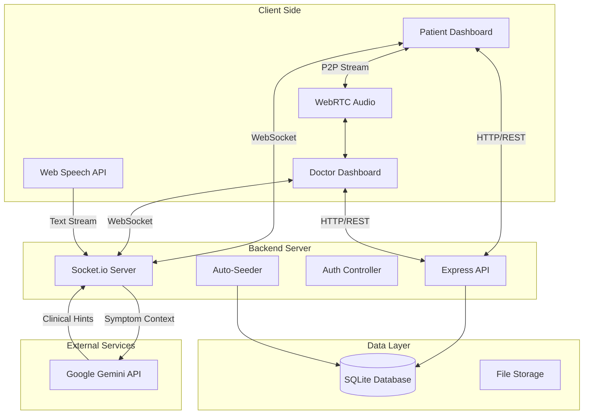

# MedAssist AI - System Architecture Document

## 1. Executive Summary
MedAssist AI is a modern telemedicine platform designed to bridge the gap between patients and doctors through AI-enhanced interactions. It features intelligent appointment booking, real-time audio consultations with live transcription, and AI-driven diagnostic assistance.

---

## 2. Technology Stack

### Frontend (Client-Side)
- **Core:** HTML5, CSS3 (Modern Glassmorphism UI), Vanilla JavaScript (ES6+).
- **Real-Time Communication:** 
  - `Socket.io-client` for signaling and chat sync.
  - **WebRTC** for peer-to-peer low-latency audio streaming.
- **AI Integration:** **Web Speech API** for client-side speech-to-text transcription.
- **Styling:** Custom responsive CSS variables, Grid/Flexbox layouts.

### Backend (Server-Side)
- **Runtime:** Node.js (v18+).
- **Framework:** Express.js (REST API).
- **Real-Time Server:** `Socket.io` (WebSocket handling).
- **AI Engine:** Google Gemini Pro (via `googleapis`) for:
  - Symptom analysis during booking.
  - Real-time consultation hints for doctors.

### Database & Storage
- **Database:** SQLite (via `sql.js` / `sqlite3`).
- **Data Model:** Relational (Patients, Doctors, Appointments, Transcripts).
- **Persistence:** Local file-based storage (`/data/medassist.db`) with auto-seeding capabilities.

### Deployment & Infrastructure
- **Containerization:** Docker (Multi-stage build).
- **Hosting:** Platform-agnostic (Render, Koyeb, Railway).
- **Environment:** Linux/Alpine Node images.

---

## 3. System Architecture Diagram

---

## 4. Core Features & Modules

### A. Intelligent Appointment Booking (Implemented)
- **Flow:** Chat-based interface where AI asks diagnostic questions before booking.
- **Logic:**
  1. User describes symptoms.
  2. AI analyzes severity and recommends a specialist.
  3. App filters available doctors by specialty.
  4. Appointment is stored in DB with "AI Summary".

### B. Live Audio Consultation (Implemented)
- **Tech:** WebRTC (Peer-to-Peer).
- **Status:** **Active & Functional**.
- **Connectivity:**
  - Establishes direct P2P voice connection.
  - Signal-based connection handling (Answer/Offer) via Socket.io.

### C. Live Dictation / Medical Scribe (Beta / In-Progress)
- **Goal:** Real-time speech-to-text.
- **Current Status:** **Prototype**.
- **Implementation:** Integrated Web Speech API, but requires browser-specific permissions and noise-free environments for reliable transcription.
- **Limitation:** Currently facing consistency issues in cross-device deployment (mobile vs desktop).

### D. AI Clinical Copilot (Roadmap)
- **Goal:** Real-time clinical hints.
- **Current Status:** **Planned**.
- **Architecture:** 
  - Backend endpoints exist for Gemini processing.
  - Frontend integration is pending robust transcription stability.

### E. Session Management
- **Security:** Session storage via LocalStorage (JWT-ready architecture).
- **State:** Persistent connection handling; auto-reconnect on network drop.
- **Record:** Full consultation transcripts are saved to the database upon call completion.

---

## 5. Security & Privacy
- **Transmission:** All data encrypted in transit (HTTPS/WSS).
- **P2P Audio:** WebRTC streams are end-to-end encrypted by default.
- **Data Isolation:** Call transcripts are stored per-appointment ID.
- **Access Control:** Role-based Middleware (Patient vs Doctor access levels).
