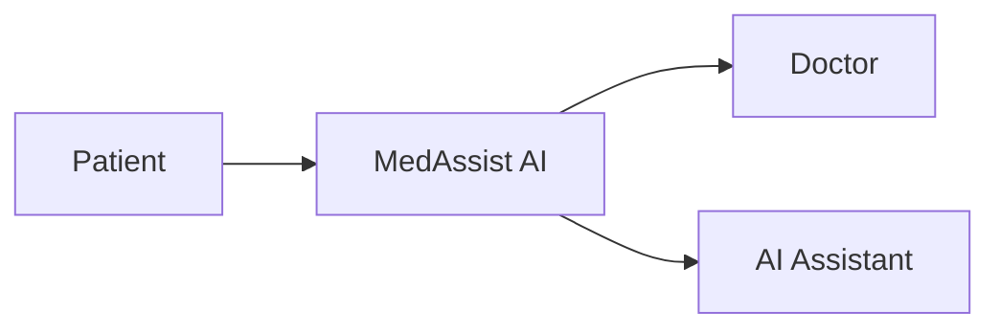
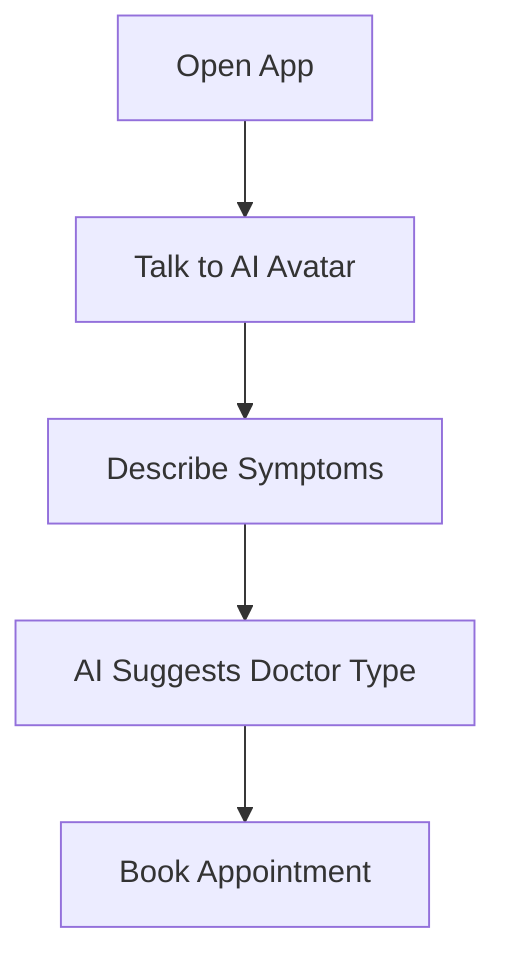
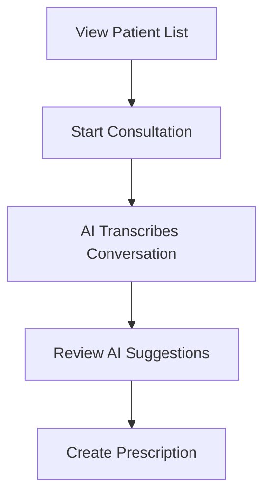
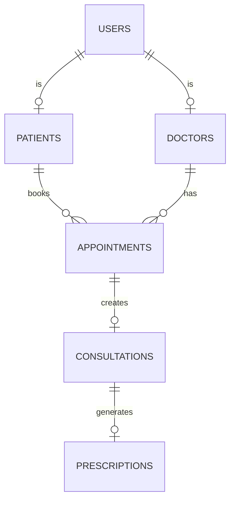

# MedAssist AI - MVP Requirements
## Software Requirements Specification (Simplified)

**Version:** 1.0  
**Date:** January 13, 2026  
**Author:** Sharique Baig

---

## 1. Overview

MedAssist AI is a mobile app that helps:
- **Patients** check symptoms and find doctors
- **Doctors** get AI assistance during consultations

### Core Idea

---

## 2. MVP Features

### 2.1 Patient Features

| Feature | Description |
|---------|-------------|
| **Symptom Check** | Talk to AI avatar, describe symptoms, get guidance |
| **Find Doctor** | AI recommends suitable specialists |
| **Book Appointment** | Schedule online or in-person visits |
| **View Prescriptions** | See medicines prescribed by doctor |

### 2.2 Doctor Features

| Feature | Description |
|---------|-------------|
| **Patient Summary** | AI-generated overview of patient history |
| **Live Transcription** | Automatic notes during consultation |
| **Diagnosis Hints** | AI suggests possible conditions |
| **Quick Prescription** | Create and send prescriptions easily |

---

## 3. User Flows

### Patient Flow

### Doctor Flow

---

## 4. Screens

### Patient App

- AI Avatar greeting
- Mic button to start talking
- Quick access to Symptoms, Appointments, Pharmacy, History

### Doctor App

- List of today's patients
- Click to see AI-generated patient summary
- Live transcription during calls

---

## 5. Tech Stack (MVP)

| Layer | Technology |
|-------|------------|
| **App** | React Native (iOS + Android) |
| **Backend** | Node.js with Express |
| **Database** | PostgreSQL |
| **AI** | Google Gemini API |
| **Voice** | Google Speech-to-Text / Text-to-Speech |

---

## 6. Database (Simplified)

### Key Tables
| Table | Purpose |
|-------|---------|
| users | Login credentials |
| patients | Patient profiles + AI summary |
| doctors | Doctor profiles + availability |
| appointments | Bookings |
| consultations | Visit records + AI notes |
| prescriptions | Medicines prescribed |

---

## 7. AI Features

| Feature | How It Works |
|---------|--------------|
| **Symptom Analysis** | Patient speaks → AI understands → suggests urgency |
| **Doctor Matching** | Based on symptoms, find right specialist |
| **Live Notes** | Speech converted to text during consultation |
| **Diagnosis Hints** | AI analyzes conversation, suggests possibilities |
| **Patient Summary** | AI condenses medical history into quick overview |

---

## 8. Security Basics

| Requirement | How |
|-------------|-----|
| Secure login | JWT tokens |
| Data privacy | HIPAA-aware design |
| Encryption | HTTPS everywhere |
| Access control | Role-based (Patient vs Doctor) |

---

## 9. MVP Scope Summary

### Included
- [x] AI symptom checker with avatar
- [x] Doctor matching and booking
- [x] Live consultation transcription
- [x] AI diagnosis suggestions
- [x] Basic prescription creation

### Not Included (Future)
- [ ] Pharmacy ordering
- [ ] Video calls
- [ ] Multi-language
- [ ] Wearable integration

---

## 10. Related Documents

| Document | Contents |
|----------|----------|
| [Technical SRS](./MedAssist-AI-SRS-Technical.md) | Full technical details, all diagrams |
| [Wireframes](./MedAssist-AI-Wireframes.md) | UI screen designs |

---

*MVP document for MedAssist AI - Zetsol Internship*
