# Software Requirements Specification (SRS)
## MedAssist AI - AI-Powered Virtual Health Assistant

**Version:** 1.0  
**Date:** January 13, 2026  
**Author:** Sharique Baig
**Project Type:** Mobile Application with AI Integration

---

## Table of Contents
1. [Executive Summary](#1-executive-summary)
2. [Introduction](#2-introduction)
3. [Research & Market Analysis](#3-research--market-analysis)
4. [System Overview](#4-system-overview)
5. [Functional Requirements](#5-functional-requirements)
6. [Non-Functional Requirements](#6-non-functional-requirements)
7. [Technology Stack](#7-technology-stack)
8. [System Architecture](#8-system-architecture)
9. [User Flows](#9-user-flows)
10. [Data Flow Diagrams](#10-data-flow-diagrams)
11. [Database Design](#11-database-design)
12. [AI Avatar Integration](#12-ai-avatar-integration)
13. [Gemini & MCP Integration](#13-gemini--mcp-integration)
14. [Dummy Data Strategy](#14-dummy-data-strategy)
15. [Security Considerations](#15-security-considerations)
16. [Appendix](#16-appendix)

---

## 1. Executive Summary

MedAssist AI is an innovative AI-powered virtual health assistant designed to bridge the gap between patients and healthcare providers. The application leverages Google's Gemini AI to provide intelligent symptom triage, doctor matching, real-time consultation transcription, and AI-assisted diagnosis support.

### Key Highlights
| Aspect | Description |
|--------|-------------|
| **Platform** | Mobile Application (Cross-platform) |
| **AI Engine** | Google Gemini (with MCP integration) |
| **Unique Feature** | AI Avatar with Lip-Sync Voice Interaction |
| **Target Users** | Patients & Healthcare Providers |
| **Cost Approach** | Primarily free/open-source tools |

---

## 2. Introduction

### 2.1 Purpose
This SRS document defines the complete software requirements for MedAssist AI, a comprehensive healthcare assistant that serves both patients and medical practitioners with AI-driven insights and automation.

### 2.2 Scope
The system encompasses:
- **Patient Portal**: Symptom assessment, doctor discovery, appointment management, pharmacy services
- **Doctor Portal**: Patient management, AI-assisted diagnostics, prescription support
- **AI Core**: Gemini-powered intelligence with conversational avatar interface

### 2.3 Definitions & Acronyms
| Term | Definition |
|------|------------|
| **MCP** | Model Context Protocol - Anthropic's protocol for AI-database connectivity |
| **TTS** | Text-to-Speech |
| **STT** | Speech-to-Text |
| **EHR** | Electronic Health Records |
| **HIPAA** | Health Insurance Portability and Accountability Act |

---

## 3. Research & Market Analysis

### 3.1 Market Landscape

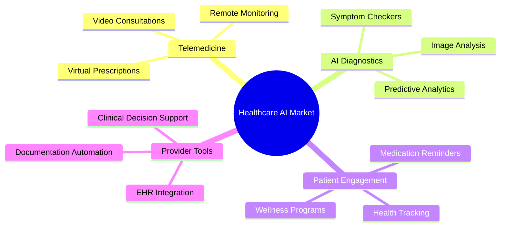

### 3.2 Competitive Analysis (2026 Market)

| Competitor | Strengths | Gaps We Address |
|------------|-----------|-----------------|
| **Ada Health** | Advanced symptom checker with ML algorithms, large medical knowledge base | No AI avatar, no doctor portal, no prescription management |
| **Symptoma** | 96.32% diagnostic accuracy, used by medical professionals globally | No real-time transcription, no pharmacy integration |
| **Buoy Health** | HIPAA-compliant triage, telehealth integration | No AI avatar interface, limited prescription support |
| **Docus AI** | Multilingual support, doctor-reviewed knowledge base | No doctor-side tools, no consultation transcription |
| **Teladoc Health** | Market leader in virtual consultations, Microsoft AI partnership | Expensive, limited AI-powered symptom analysis |
| **K Health** | Strong doctor matching, affordable pricing | No real-time transcription, no AI avatar |

> [!NOTE]
> Babylon Health (formerly a major competitor) filed for bankruptcy in August 2023 and ceased operations. The market has since consolidated around the competitors listed above.

### 3.3 Market Trends (2025-2026)

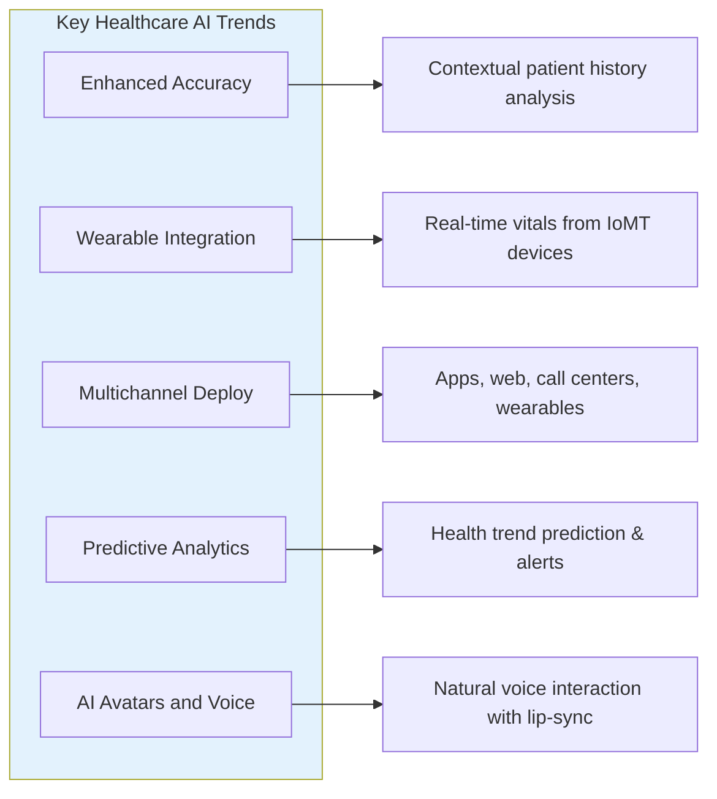

### 3.4 Research References

1. **WHO Digital Health Guidelines (2024)** - Updated standards for AI in healthcare
2. **Google Gemini Medical Research (2026)** - Gemini 3.0's medical reasoning and multimodal capabilities
3. **MarketsandMarkets AI Telehealth Report (2025)** - AI in telehealth market projected to reach $27.14B by 2030
4. **HL7 FHIR R5 Standards (2024)** - Latest healthcare data interoperability standards
5. **NVIDIA Healthcare AI & Omniverse (2025)** - Avatar and real-time voice synthesis technologies

---

## 4. System Overview

### 4.1 High-Level System Context

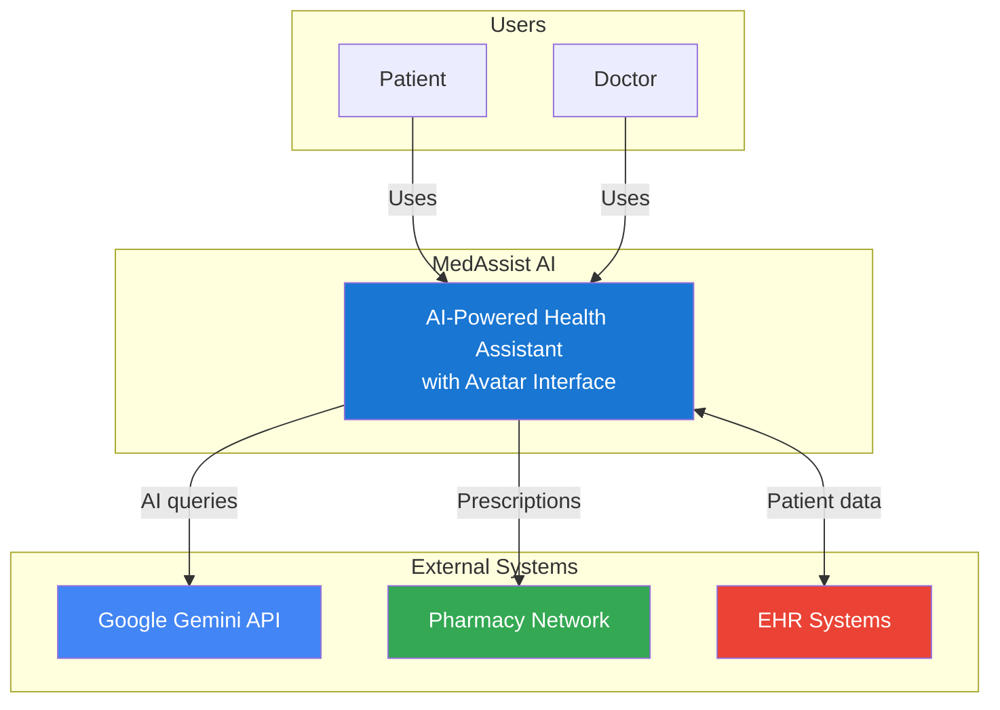

### 4.2 User Roles

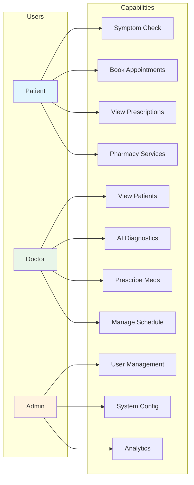

---

## 5. Functional Requirements

### 5.1 Patient End Features

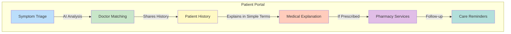

#### FR-P01: AI Symptom Triage
| ID | Requirement |
|----|-------------|
| FR-P01.1 | System shall conduct conversational symptom assessment via AI avatar |
| FR-P01.2 | System shall collect initial patient data (vitals, symptoms, duration) |
| FR-P01.3 | System shall provide urgency classification (Emergency/Urgent/Routine) |
| FR-P01.4 | System shall reduce wait times by pre-collecting information |

#### FR-P02: Doctor Matching
| ID | Requirement |
|----|-------------|
| FR-P02.1 | System shall analyze symptoms to match appropriate specialists |
| FR-P02.2 | System shall offer online and in-person consultation options |
| FR-P02.3 | System shall display doctor availability and ratings |
| FR-P02.4 | System shall allow filtering by distance, availability, and specialty |

#### FR-P03: Patient History Management
| ID | Requirement |
|----|-------------|
| FR-P03.1 | System shall gather and store patient medical history |
| FR-P03.2 | System shall share relevant history with consulting doctor |
| FR-P03.3 | System shall maintain chronological health records |
| FR-P03.4 | System shall allow patient to add/edit health information |

#### FR-P04: Medical Explanation
| ID | Requirement |
|----|-------------|
| FR-P04.1 | System shall explain doctor's advice in layman terms via avatar |
| FR-P04.2 | System shall offer health counseling and guidance |
| FR-P04.3 | System shall use voice with lip-sync animation |
| FR-P04.4 | System shall support multiple languages |

#### FR-P05: Pharmacy Services
| ID | Requirement |
|----|-------------|
| FR-P05.1 | System shall facilitate pharmacy bookings |
| FR-P05.2 | System shall suggest pickup options and delivery |
| FR-P05.3 | System shall show medication availability |
| FR-P05.4 | System shall provide medication reminders |

#### FR-P06: Preventive Care Reminders
| ID | Requirement |
|----|-------------|
| FR-P06.1 | System shall send vaccination reminders |
| FR-P06.2 | System shall notify about routine check-ups |
| FR-P06.3 | System shall provide personalized health tips |

---

### 5.2 Doctor End Features

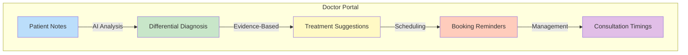

#### FR-D01: Patient Notes Assistant
| ID | Requirement |
|----|-------------|
| FR-D01.1 | System shall assist in writing detailed patient notes |
| FR-D01.2 | System shall transcribe doctor-patient conversations in real-time |
| FR-D01.3 | System shall generate structured consultation scripts |
| FR-D01.4 | System shall store notes securely for future reference |

#### FR-D02: Differential Diagnosis
| ID | Requirement |
|----|-------------|
| FR-D02.1 | System shall provide AI-generated differential diagnosis options |
| FR-D02.2 | System shall rank diagnoses by probability |
| FR-D02.3 | System shall cite supporting evidence and literature |
| FR-D02.4 | System shall learn from doctor's final decisions |

#### FR-D03: Treatment & Test Suggestions
| ID | Requirement |
|----|-------------|
| FR-D03.1 | System shall suggest appropriate diagnostic tests |
| FR-D03.2 | System shall recommend evidence-based treatments |
| FR-D03.3 | System shall check for drug interactions |
| FR-D03.4 | System shall allow customization of prescriptions |

#### FR-D04: Booking & Schedule Management
| ID | Requirement |
|----|-------------|
| FR-D04.1 | System shall send booking reminders to doctors |
| FR-D04.2 | System shall help set consultation timings |
| FR-D04.3 | System shall manage appointment calendar |
| FR-D04.4 | System shall handle cancellations and rescheduling |

---

### 5.3 AI Core Features

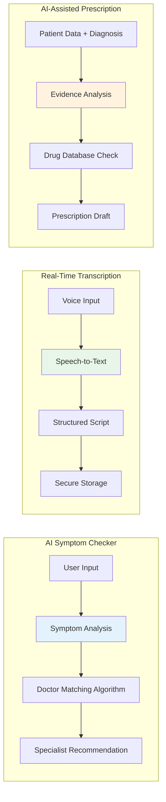

---

## 6. Non-Functional Requirements

### 6.1 Performance Requirements

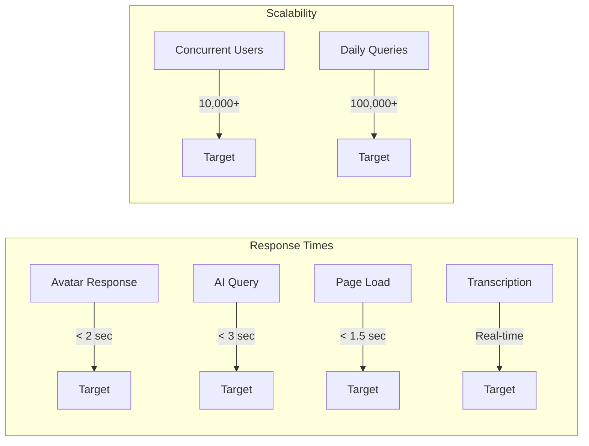

| NFR ID | Category | Requirement |
|--------|----------|-------------|
| NFR-01 | Performance | Avatar response latency < 2 seconds |
| NFR-02 | Performance | AI query response < 3 seconds |
| NFR-03 | Scalability | Support 10,000+ concurrent users |
| NFR-04 | Availability | 99.9% uptime SLA |
| NFR-05 | Reliability | Automatic failover for critical services |

### 6.2 Security & Compliance

| NFR ID | Category | Requirement |
|--------|----------|-------------|
| NFR-06 | Security | End-to-end encryption for all data |
| NFR-07 | Compliance | HIPAA compliance for health data |
| NFR-08 | Authentication | Multi-factor authentication support |
| NFR-09 | Audit | Complete audit logging of all actions |
| NFR-10 | Privacy | GDPR-compliant data handling |

### 6.3 Usability

| NFR ID | Category | Requirement |
|--------|----------|-------------|
| NFR-11 | Accessibility | WCAG 2.1 AA compliance |
| NFR-12 | Languages | Multi-language support (English, Urdu, Arabic) |
| NFR-13 | Platform | iOS 14+, Android 10+ support |
| NFR-14 | Offline | Basic functionality without internet |

---

## 7. Technology Stack

### 7.1 Overview

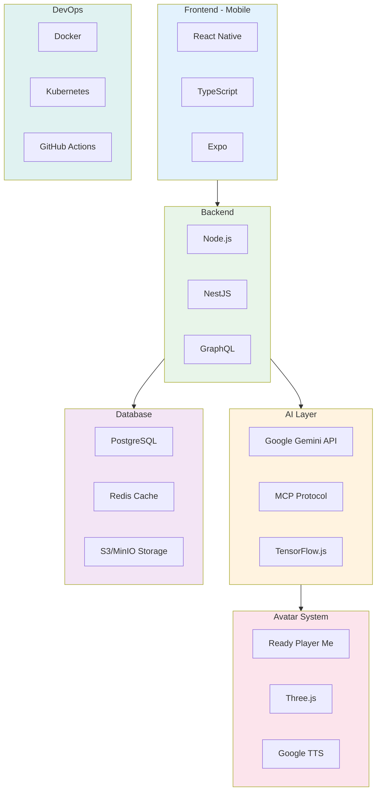

### 7.2 Detailed Stack (Free/Open-Source Priority)

#### Frontend
| Component | Technology | License | Cost |
|-----------|------------|---------|------|
| Framework | React Native | MIT | Free |
| Language | TypeScript | Apache 2.0 | Free |
| UI Library | React Native Paper | MIT | Free |
| Navigation | React Navigation | MIT | Free |
| State | Zustand | MIT | Free |
| Build Tool | Expo | MIT | Free |

#### Backend
| Component | Technology | License | Cost |
|-----------|------------|---------|------|
| Runtime | Node.js 20 LTS | MIT | Free |
| Framework | NestJS | MIT | Free |
| API | GraphQL (Apollo) | MIT | Free |
| Auth | Passport.js + JWT | MIT | Free |
| Validation | Zod | MIT | Free |
| ORM | Prisma | Apache 2.0 | Free |

#### AI & ML
| Component | Technology | License | Cost |
|-----------|------------|---------|------|
| LLM | Google Gemini API | Commercial | Free Tier (60 req/min) |
| MCP Client | @modelcontextprotocol/sdk | MIT | Free |
| Speech-to-Text | Google Cloud STT | Commercial | Free Tier (60 min/month) |
| Text-to-Speech | Google Cloud TTS | Commercial | Free Tier (4M chars/month) |
| Local ML | TensorFlow.js | Apache 2.0 | Free |

#### Avatar System
| Component | Technology | License | Cost |
|-----------|------------|---------|------|
| 3D Avatar | Ready Player Me | Freemium | Free Tier |
| 3D Rendering | Three.js | MIT | Free |
| Lip Sync | Rhubarb Lip Sync | MIT | Free |
| Animation | GSAP | Free for non-commercial | Free |

#### Database & Storage
| Component | Technology | License | Cost |
|-----------|------------|---------|------|
| Primary DB | PostgreSQL 16 | PostgreSQL License | Free |
| Cache | Redis | BSD | Free |
| Object Storage | MinIO | AGPL | Free |
| Search | Meilisearch | MIT | Free |

#### DevOps
| Component | Technology | License | Cost |
|-----------|------------|---------|------|
| Containers | Docker | Apache 2.0 | Free |
| Orchestration | Kubernetes | Apache 2.0 | Free |
| CI/CD | GitHub Actions | Commercial | Free Tier |
| Monitoring | Prometheus + Grafana | Apache 2.0 | Free |

### 7.3 MVP/POC Development Strategy

> [!TIP]
> **Streamlined Architecture for MVP**: To ensure rapid delivery of the Proof of Concept (POC), we will intentionally omit complex infrastructure components that are not critical for a demo.

#### What We Are Skipping (Complexity Reduction)
| Component | Status in MVP | Solution for MVP |
|-----------|---------------|------------------|
| **Redis Cache** | ❌ Removed | Fetch data directly from PostgreSQL. Performance impact is negligible for < 100 users. |
| **Api Gateway (Kong)** | ❌ Removed | Direct API calls to the backend. No complex routing needed. |
| **Rate Limiter** | ❌ Removed | Not needed for internal testing/demo. |
| **Microservices** | ❌ Removed | Single Monolithic application (NestJS or Express) is faster to build and deploy. |
| **Kubernetes** | ❌ Removed | Deploy via simple Docker Compose or direct cloud hosting (e.g., Vercel/Render). |

#### The "All-in-One" Logic Flow
For the MVP, the logic is linear and simple:
1. **App** sends request directly to **Backend**.
2. **Backend** queries **Gemini** or **Database**.
3. **Backend** responds.
*(No caching layers, no gateway checks, no service meshes).*

---

## 8. System Architecture

### 8.1 High-Level Architecture

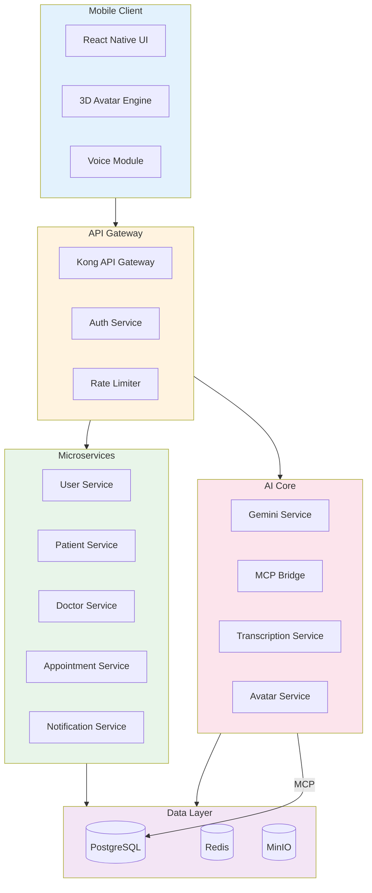

### 8.2 Component Diagram

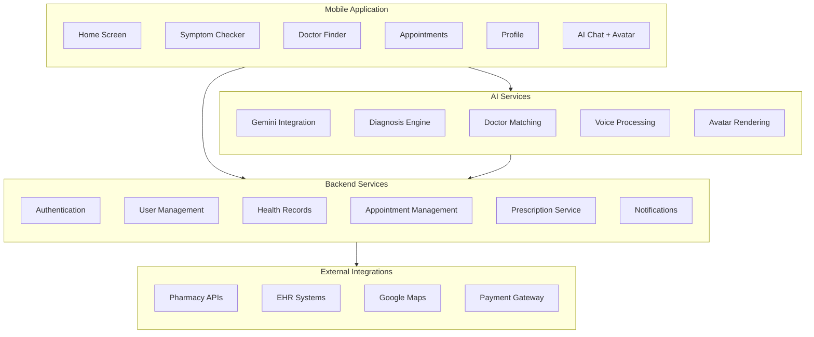

### 8.3 Deployment Architecture

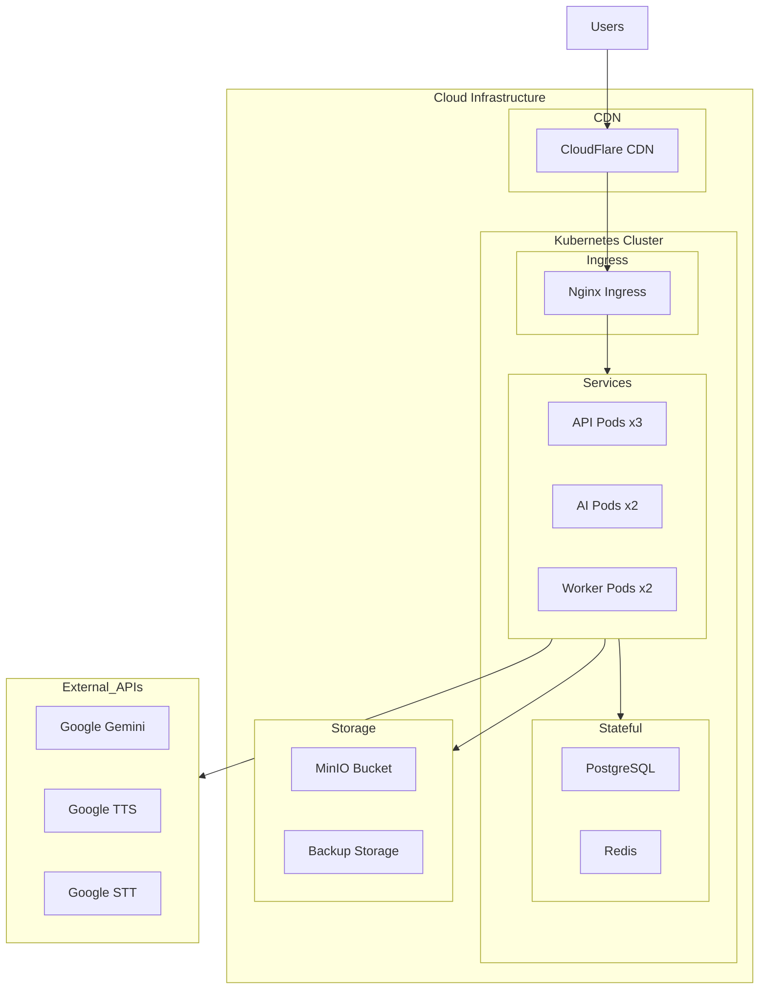

---

## 9. User Flows

### 9.1 Patient Symptom Check Flow

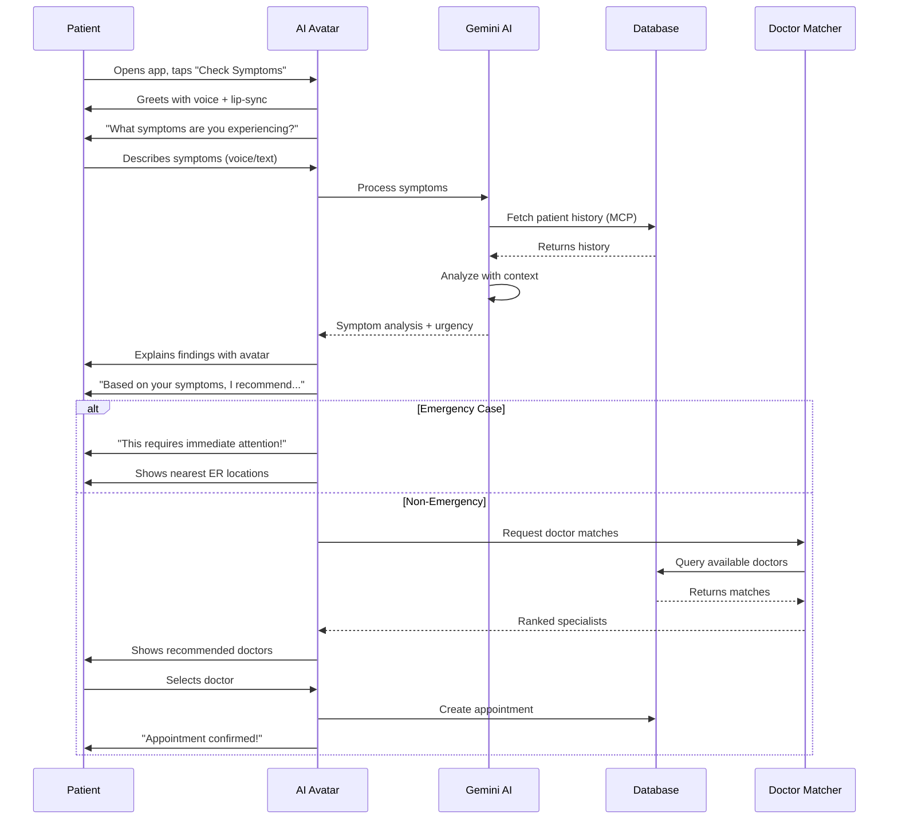

### 9.2 Doctor Consultation Flow

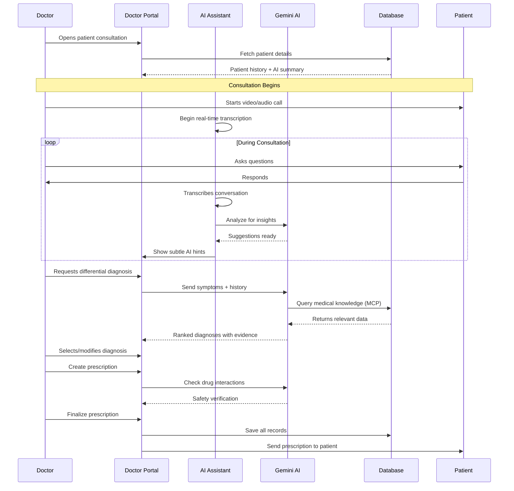

### 9.3 Pharmacy Booking Flow

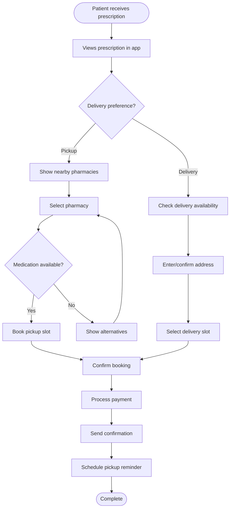

### 9.4 AI Avatar Interaction Flow

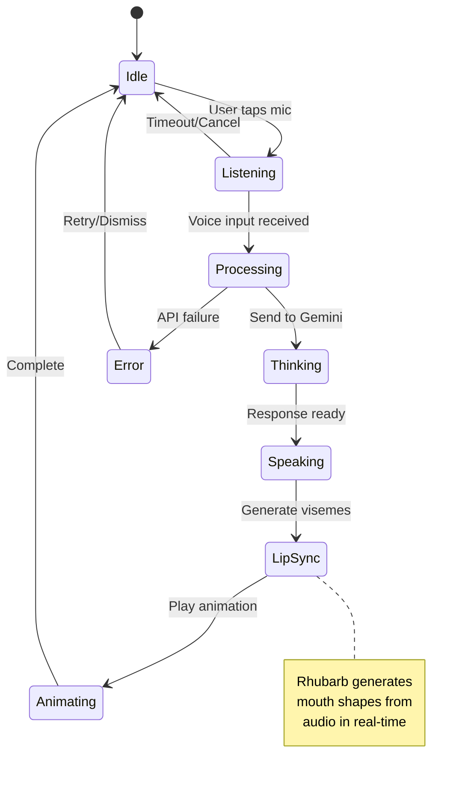

---

## 10. Data Flow Diagrams

### 10.1 Level 0 - Context Diagram

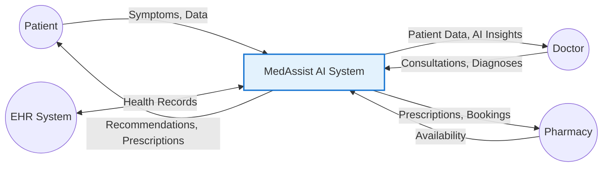

### 10.2 Level 1 - System Processes

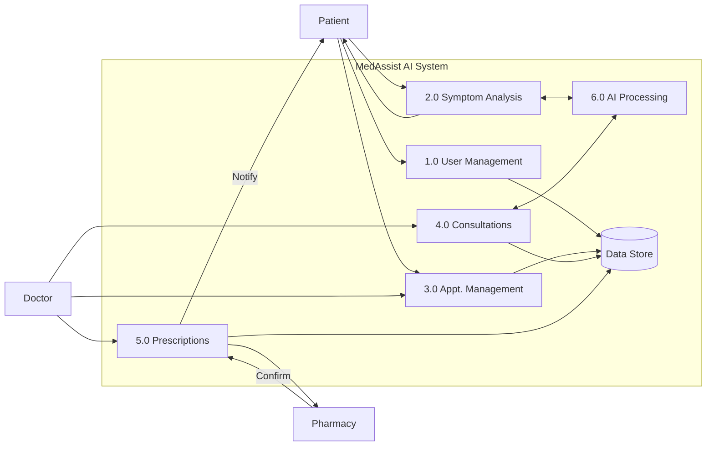

### 10.3 AI Data Processing Flow

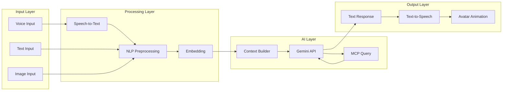

---

## 11. Database Design

### 11.1 Entity Relationship Diagram

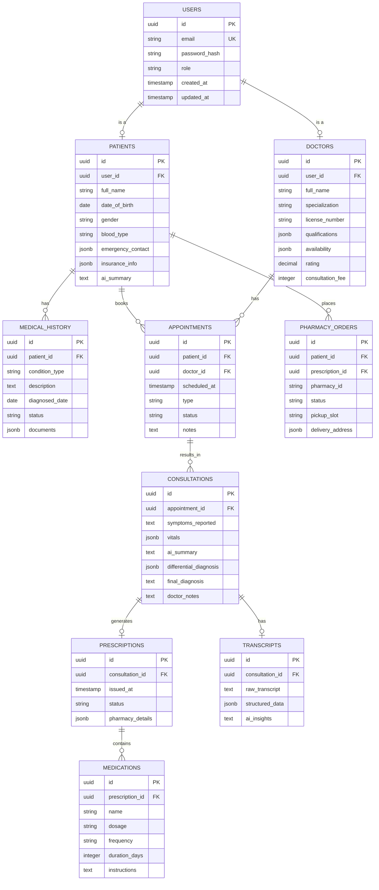

### 11.2 Database Schema Summary

| Table | Description | Key Relationships |
|-------|-------------|-------------------|
| `users` | Base user authentication | Parent of patients, doctors |
| `patients` | Patient profile + **AI Summary** | Has medical history, appointments |
| `doctors` | Doctor profile and availability | Has appointments, consultations |
| `medical_history` | Chronic conditions, allergies | Belongs to patient |
| `appointments` | Booking records | Links patient and doctor |
| `consultations` | Consultation details + AI insights | Links to appointment, transcript |
| `prescriptions` | Prescription records | Generated from consultation |
| `medications` | Individual medicine entries | Part of prescription |
| `transcripts` | Voice transcription data | Linked to consultation |
| `pharmacy_orders` | Pharmacy fulfillment | Links prescription to pharmacy |

---

## 12. AI Avatar Integration

### 12.1 Avatar System Architecture

```mermaid
flowchart TB
    subgraph Input
        TEXT_IN[Text Response from AI]
        AUDIO_IN[TTS Audio Stream]
    end
    
    subgraph Processing
        PHONEME[Phoneme Extraction]
        VISEME[Viseme Mapping]
        TIMING[Timing Synchronization]
    end
    
    subgraph Rendering
        MODEL[3D Avatar Model]
        MORPH[Morph Target Animation]
        BLEND[Blend Shape Controller]
        RENDER[Three.js Renderer]
    end
    
    subgraph Output
        CANVAS[WebGL Canvas]
        AUDIO_OUT[Synchronized Audio]
    end
    
    TEXT_IN --> PHONEME
    AUDIO_IN --> PHONEME
    PHONEME --> VISEME
    VISEME --> TIMING
    TIMING --> MORPH
    MODEL --> BLEND
    MORPH --> BLEND
    BLEND --> RENDER
    RENDER --> CANVAS
    AUDIO_IN --> AUDIO_OUT
    
    style VISEME fill:#e8f5e9
    style BLEND fill:#fff3e0
```

### 12.2 Lip Sync Implementation

```mermaid
sequenceDiagram
    participant AI as Gemini AI
    participant TTS as Google TTS
    participant RHUBARB as Rhubarb Lip Sync
    participant THREE as Three.js
    participant USER as User Screen
    
    AI->>TTS: Send text response
    TTS->>TTS: Generate audio
    TTS->>RHUBARB: Audio file
    RHUBARB->>RHUBARB: Analyze phonemes
    RHUBARB->>THREE: Viseme timeline JSON
    TTS->>THREE: Audio stream
    
    loop Playback
        THREE->>THREE: Update morph targets
        THREE->>USER: Render frame
        THREE->>USER: Play audio
    end
```

### 12.3 Avatar Technical Specs

| Component | Technology | Purpose |
|-----------|------------|---------|
| 3D Model | Ready Player Me GLB | Customizable avatar |
| Renderer | Three.js | WebGL 3D rendering |
| Lip Sync | Rhubarb Lip Sync | Phoneme-to-viseme mapping |
| Animation | GSAP | Smooth morph transitions |
| Voice | Google Cloud TTS | Natural voice synthesis |

### 12.4 Viseme Mapping

| Phoneme | Viseme | Description |
|---------|--------|-------------|
| A, E, I | `viseme_aa` | Open mouth |
| O | `viseme_O` | Round lips |
| U | `viseme_U` | Pursed lips |
| F, V | `viseme_FF` | Lower lip under teeth |
| M, B, P | `viseme_PP` | Closed lips |
| S, Z | `viseme_SS` | Teeth together |
| TH | `viseme_TH` | Tongue between teeth |
| L | `viseme_nn` | Tongue to palate |

### 12.5 Simplified POC Approach (Recommended)

> [!TIP]
> **For the POC/MVP phase**, implementing the full 3D pipeline above is complex. We recommend using a simplified approach to save time.

#### Option A: External API (Simli / HeyGen)
Instead of building the rendering engine, use an API that returns a video stream.
1. Send text to API.
2. API returns video URL of avatar speaking.
3. App plays video.
**Pros:** Extremely realistic, very little code.
**Cons:** Cost per minute (usually has free tier).

#### Option B: "Talking" State Loop
A simple but effective trick for demos.
1. Use a pre-made 3D avatar scene (Ready Player Me).
2. Create two animations: "Idle" and "Talking" (random mouth movement).
3. **Pseudo-Lip-Sync Logic:**
   - `Event: Audio_Start` -> Play "Talking" animation.
   - `Event: Audio_End` -> Play "Idle" animation.
**Pros:** Free, implements in < 1 hour.
**Cons:** Lips don't match exact words (users rarely notice in quick demos).

---

## 13. Gemini & MCP Integration

### 13.1 MCP Architecture for Database Access

```mermaid
flowchart LR
    subgraph Client ["Mobile App"]
        UI[User Interface]
        SDK[Gemini SDK]
    end
    
    subgraph MCP_Server ["MCP Server"]
        BRIDGE[MCP Bridge]
        TOOLS[Tool Registry]
        RESOURCES[Resource Provider]
    end
    
    subgraph Database ["PostgreSQL"]
        PATIENTS[(patients)]
        HISTORY[(medical_history)]
        CONSULTS[(consultations)]
    end
    
    subgraph Gemini ["Gemini API"]
        LLM[Gemini 3.0 Flash]
    end
    
    UI --> SDK
    SDK --> LLM
    LLM <--> BRIDGE
    BRIDGE --> TOOLS
    BRIDGE --> RESOURCES
    TOOLS --> Database
    RESOURCES --> Database
    
    style BRIDGE fill:#e8f5e9
    style LLM fill:#fff3e0
```

### 13.2 MCP Tool Definitions

```mermaid
classDiagram
    class MCPServer {
        +name: string
        +version: string
        +listTools()
        +callTool(name, args)
        +listResources()
        +readResource(uri)
    }
    
    class PatientHistoryTool {
        +name: "get_patient_history"
        +description: "Retrieve patient medical history"
        +inputSchema: PatientHistoryInput
        +execute(patientId): HistorySummary
    }
    
    class DiagnosisTool {
        +name: "search_diagnoses"
        +description: "Search for diagnostic information"
        +inputSchema: DiagnosisInput
        +execute(symptoms): DiagnosisList
    }
    
    class MedicationTool {
        +name: "check_medications"
        +description: "Check drug interactions"
        +inputSchema: MedicationInput
        +execute(drugs): InteractionReport
    }
    
    class AppointmentTool {
        +name: "manage_appointments"
        +description: "Create/update appointments"
        +inputSchema: AppointmentInput
        +execute(action, data): AppointmentResult
    }
    
    MCPServer --> PatientHistoryTool
    MCPServer --> DiagnosisTool
    MCPServer --> MedicationTool
    MCPServer --> AppointmentTool
```

### 13.3 Gemini Integration for Doctor Summary

```mermaid
sequenceDiagram
    participant D as Doctor
    participant APP as App
    participant GEM as Gemini API
    participant MCP as MCP Server
    participant DB as PostgreSQL
    
    D->>APP: Open patient file
    APP->>GEM: Request patient summary
    
    Note over GEM,MCP: MCP Tool Call
    GEM->>MCP: get_patient_history(patient_id)
    MCP->>DB: SELECT * FROM medical_history...
    DB-->>MCP: Raw history records
    MCP-->>GEM: Structured history data
    
    GEM->>MCP: get_recent_visits(patient_id)
    MCP->>DB: SELECT * FROM consultations...
    DB-->>MCP: Visit records
    MCP-->>GEM: Visit data
    
    GEM->>GEM: Synthesize concise summary
    GEM-->>APP: AI-Generated Summary
    APP-->>D: Display formatted summary
    
    Note over D: Doctor sees:<br>"45yo male, diabetic since 2020,<br>last visit for chest pain - cardiac workup negative,<br>currently on Metformin 500mg BID"
```

### 13.4 Example MCP Tools

| Tool Name | Description | Use Case |
|-----------|-------------|----------|
| `get_patient_history` | Fetches complete medical history | Doctor viewing patient before consultation |
| `summarize_history` | AI-powered summary of history | Quick overview for busy doctors |
| `search_symptoms` | Search symptom database | Patient symptom checker |
| `find_doctors` | Query available specialists | Doctor matching |
| `check_interactions` | Drug interaction check | Prescription safety |
| `create_appointment` | Book appointments | Scheduling |

---

## 14. Dummy Data Strategy

### 14.1 Data Generation Plan

```mermaid
pie title Dummy Data Distribution
    "Patients" : 100
    "Doctors" : 25
    "Medical History" : 300
    "Appointments" : 200
    "Consultations" : 150
    "Prescriptions" : 120
```

### 14.2 Data Volume Targets

| Entity | Count | Rationale |
|--------|-------|-----------|
| Patients | 100 | Diverse age, gender, conditions |
| Doctors | 25 | Multiple specializations |
| Medical History Records | 300 | ~3 conditions per patient avg |
| Appointments | 200 | Mix of past/future |
| Consultations | 150 | 75% completion rate |
| Prescriptions | 120 | Multiple meds per consultation |
| Transcripts | 50 | Sample conversation data |

### 14.3 Data Categories

```mermaid
graph TB
    subgraph Patients ["Patient Data"]
        P1[Demographics]
        P2[Contact Info]
        P3[Insurance]
        P4[Emergency Contacts]
    end
    
    subgraph Medical ["Medical Data"]
        M1[Chronic Conditions]
        M2[Allergies]
        M3[Medications]
        M4[Vitals History]
    end
    
    subgraph Clinical ["Clinical Data"]
        C1[Visit Notes]
        C2[Diagnoses]
        C3[Prescriptions]
        C4[Lab Results]
    end
    
    Patients --> Medical
    Medical --> Clinical
```

### 14.4 Realistic Data Patterns

| Category | Examples |
|----------|----------|
| **Common Conditions** | Hypertension, Diabetes Type 2, Asthma, Anxiety, Migraine |
| **Specializations** | Cardiology, Dermatology, Orthopedics, ENT, General Medicine |
| **Medications** | Metformin, Lisinopril, Omeprazole, Atorvastatin, Amlodipine |
| **Age Distribution** | 20% children, 50% adults, 30% elderly |
| **Visit Reasons** | Follow-up (40%), New complaint (35%), Emergency (10%), Preventive (15%) |

### 14.5 Generation Script Approach

```mermaid
flowchart LR
    A[Faker.js Library] --> B[Generate Base Data]
    B --> C[Apply Medical Logic]
    C --> D[Create Relationships]
    D --> E[Seed Database]
    E --> F[Verify Integrity]
    
    style A fill:#e3f2fd
    style F fill:#e8f5e9
```

---

## 15. Security Considerations

### 15.1 Security Architecture

```mermaid
flowchart TB
    subgraph Client_Security ["Client Security"]
        SSL[SSL/TLS Encryption]
        BIOMETRIC[Biometric Auth]
        SECURE_STORE[Secure Storage]
    end
    
    subgraph API_Security ["API Security"]
        JWT[JWT Tokens]
        RBAC[Role-Based Access]
        RATE_LIMIT[Rate Limiting]
        WAF[Web Application Firewall]
    end
    
    subgraph Data_Security ["Data Security"]
        ENCRYPT[AES-256 Encryption]
        MASK[Data Masking]
        AUDIT[Audit Logging]
        BACKUP[Encrypted Backups]
    end
    
    subgraph Compliance ["Compliance"]
        HIPAA[HIPAA Controls]
        GDPR[GDPR Compliance]
        SOC2[SOC 2 Type II]
    end
    
    Client_Security --> API_Security
    API_Security --> Data_Security
    Data_Security --> Compliance
```

### 15.2 Data Protection Matrix

| Data Type | At Rest | In Transit | Access Control |
|-----------|---------|------------|----------------|
| PHI (Health Info) | AES-256 | TLS 1.3 | RBAC + MFA |
| PII (Personal Info) | AES-256 | TLS 1.3 | RBAC |
| Credentials | Bcrypt Hash | TLS 1.3 | System Only |
| Session Data | Encrypted | TLS 1.3 | User Scope |
| AI Transcripts | AES-256 | TLS 1.3 | Doctor + Patient |

---

## 16. Appendix

### 16.1 Glossary

| Term | Definition |
|------|------------|
| **Differential Diagnosis** | List of possible conditions matching symptoms |
| **MCP** | Model Context Protocol for AI-database interaction |
| **PHI** | Protected Health Information |
| **Viseme** | Visual representation of a phoneme (mouth shape) |
| **Triage** | Process of determining urgency of treatment |

### 16.2 Reference Documents

1. Google Gemini API Documentation
2. MCP Protocol Specification
3. HIPAA Technical Safeguards Guide
4. Ready Player Me SDK Documentation
5. Rhubarb Lip Sync Documentation

### 16.3 Version History

| Version | Date | Author | Changes |
|---------|------|--------|---------|
| 1.0 | 2026-01-13 | Sharique Baig | Initial SRS |

---


### 16.4 UI Wireframes
> [!NOTE]
> Wireframes have been moved to a separate design document to maintain readability.
> Please refer to **[MedAssist-AI-Wireframes.md](./MedAssist-AI-Wireframes.md)** for all visual designs and layouts.

---

*Document generated for Zetsol Internship - MedAssist AI Project*
