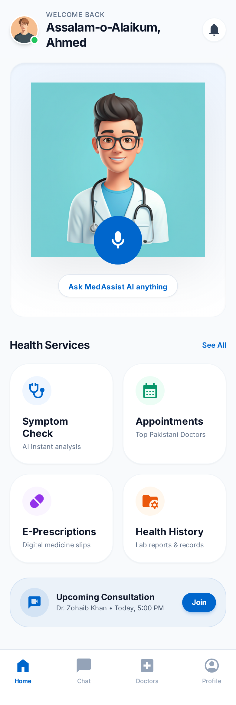
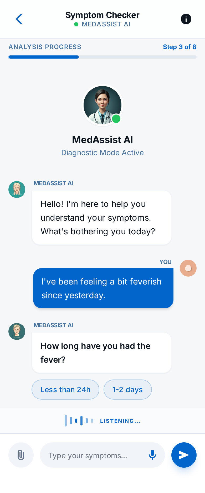
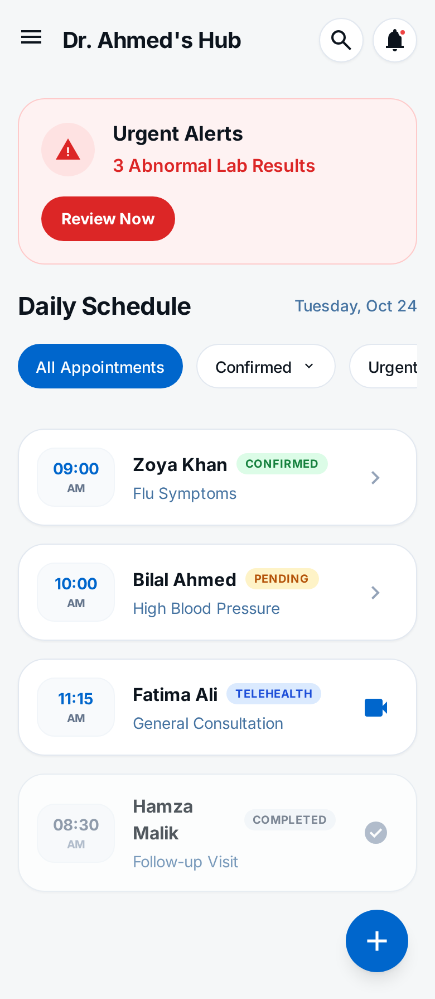
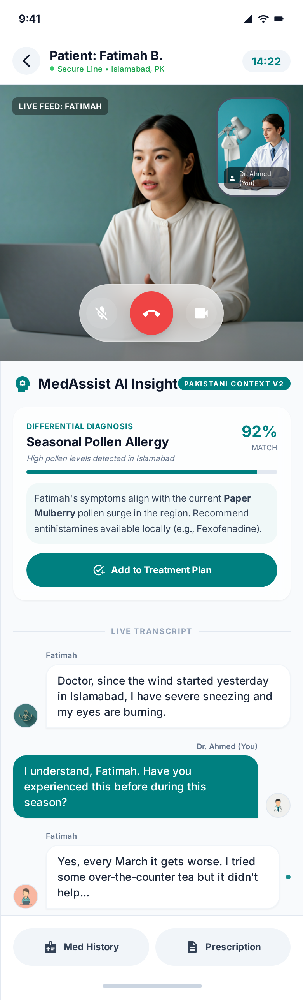

# MedAssist AI - UI/UX Wireframes

**Project:** MedAssist AI - Virtual Health Assistant  
**Version:** 1.0  
**Date:** January 13, 2026
**Author:** Sharique Baig

---

## 1. Overview
This document serves as the repository for all UI/UX wireframes and visual design concepts for the MedAssist AI application.

## 2. Patient Portal

### 2.1 Home / Dashboard

**Screen Overview:**
This serves as the central hub for the patient. The design prioritizes **immediate action** and **comfort**.
*   **AI Avatar Greeting:** Takes prominent screen space to establish a human connection immediately. The avatar (Ready Player Me integration) is animated and interactive, ready to listen.
*   **Central Mic Button:** A large, pulsing microphone icon invites voice interaction, making the app accessible for elderly users or those who prefer speaking over typing.
*   **Quick Actions Grid:** Four clear entry points for common tasks:
    *   **Check Symptoms:** Launches the AI triage.
    *   **My Appointments:** View upcoming doctor visits.
    *   **Pharmacy:** Manage prescriptions and orders.
    *   **History:** Access medical records.
*   **Navigation:** Standard bottom bar for easy switching between Chat, Records, and Profile.

### 2.2 Symptom Check Interface

**Screen Overview:**
The core diagnostic interface, designed to feel like a natural conversation rather than a form.
*   **Visual Context:** The AI Avatar remains visible at the top, providing non-verbal cues (nodding, listening) to maintain engagement.
*   **Chat Interface:** Familiar messaging layout.
    *   **Grey Bubbles (Left):** Questions from the AI (e.g., "How long have you had the fever?").
    *   **Blue Bubbles (Right):** User responses.
*   **Input Methods:** Users can either type their symptoms or use the **Voice Toggle** to speak naturally, which the system transcribes in real-time.

## 3. Doctor Portal

### 3.1 Doctor Dashboard

**Screen Overview:**
A tablet-optimized dashboard giving doctors a "Mission Control" view of their day.
*   **Sidebar Navigation:** Persistent access to Patients, Schedule, and Settings on the left.
*   **Daily Schedule:** The main view listing upcoming appointments, showing:
    *   **Patient Name & Image:** For quick identification.
    *   **Reason/Symptom:** Brief context (e.g., "Flu Symptoms").
    *   **Status Tags:** Visual indicators (Confirmed, Check-in).
*   **Urgent Alerts:** A widget (often top-right) highlighting critical lab results or urgent patient messages that need immediate attention.

### 3.2 Consultation View

**Screen Overview:**
The telemedicine interface where the actual consultation occurs.
*   **Split-Screen Layout:**
    *   **Left (Video):** Standard high-quality video feed of the patient.
    *   **Right (AI Tools):** The "Superpower" panel for the doctor.
*   **AI Features:**
    *   **Live Transcript:** Accurately logs the conversation in real-time.
    *   **Differential Diagnosis Cards:** AI analyzes the transcript and surfacing potential diagnoses (e.g., "Seasonal Allergies 85%") as clickable suggestions.
    *   **Quick Actions:** One-tap buttons to "Add to Notes" or "Prescribe", speeding up documentation.
  - **Right (50%):** AI Assistant Panel.
    - **Live Transcript:** Scrolling text of conversation.
    - **Live Insights:** Floating cards with "Potential Diagnosis: Flu (90%)" or "Ask about fever duration".
    - **Quick Actions:** "Create Prescription", "View History".

## 4. Mobile Responsiveness
*Drawings/Screenshots showing how the layout adapts to smaller screens.*

---
*To be updated during the Design Phase.*
